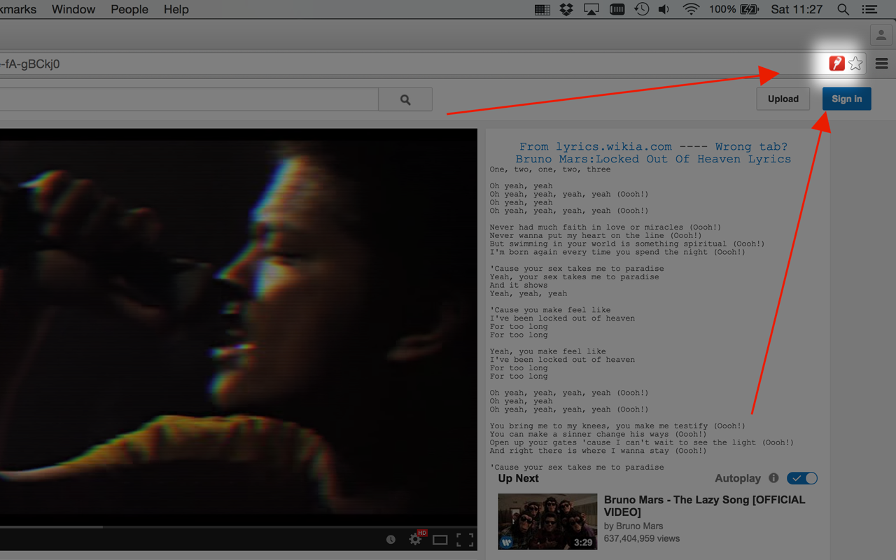
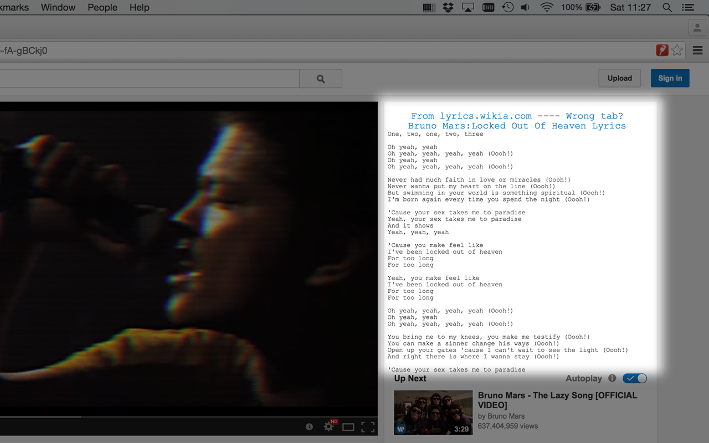

# Youtube Karaoke
http://www.richard-stanton.com/chrome-plugins/youtube-karaoke/

YouTube Karaoke attempts to remove the vocals from the video.

Simply click the Karaoke button that appears in the YouTube player, as illustrated with a microphone.

* This requires the HTML5 YouTube Player. Protected flash videos, such as VEVO, will unfortunately not work.
* This technique does not work with some songs.

The plugin also attempts to find lyrics
If you have any problems or question please use the "Send Feedback" link from the settings page.

## Tech
Chrome plugin  
Built with html5, javascript and webkitAudio  

## Screenshots

